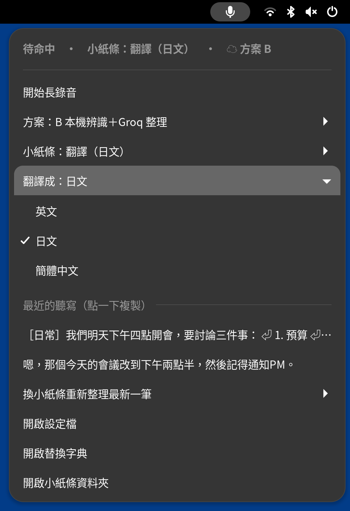
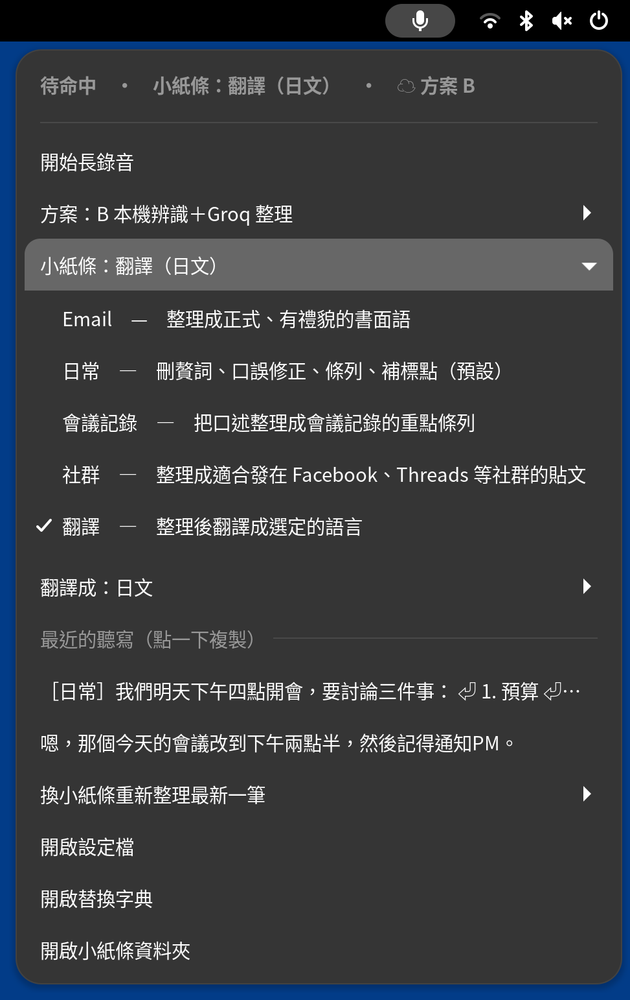

# 但聞人語（danwen）

> 空山不見人，但聞人語響。——王維〈鹿柴〉

GNOME Wayland 上的語音聽寫：**按住右 Ctrl 說話，放開後自動貼上繁體中文**。

- **快速模式**：語音辨識在本機（SenseVoice，CPU），不需連網，放開到貼上約 0.3 秒（方案 C、D 才改用雲端辨識）
- **整理模式**：再交給 LLM 依「小紙條」刪贅詞、條列、改寫成 Email、社群貼文，或翻譯成英文、日文、簡體中文。
  可用本機 Ollama（離線）或雲端；預設方案 B 用 Groq（需自備免費的 API Key，存在 GNOME 鑰匙圈）
- 不動 fcitx5／IBus 設定，可以跟注音輸入法並用；`uninstall.sh` 可完整移除
- 選用的 GNOME Shell extension：頂列圖示與選單、錄音時的畫面提示、滾輪切換小紙條


規格與設計決策見 [SPEC.md](SPEC.md)。

## 安裝

需要 Ubuntu 24.04（GNOME 46、Wayland）與 [uv](https://docs.astral.sh/uv/)：

```bash
git clone https://github.com/shih-ch/unseen-voice.git
cd unseen-voice
./install.sh                    # 只裝 backend A（SenseVoice，CPU）
./install.sh --with-whisper     # 另外編譯 whisper.cpp（Vulkan），啟用 backend B
./install.sh --with-extension   # 另外安裝 GNOME Shell extension（頂列圖示、選單、錄音提示）
```

安裝腳本會：
- 用 apt 安裝缺少的 `xclip`、`libportaudio2`、`libnotify-bin`（加 `--with-whisper` 時還有編譯工具與 `glslc`）
- 把你加入 `input` 群組（讀取熱鍵），並新增 `/etc/udev/rules.d/70-danwen-uinput.rules`（虛擬鍵盤）
- 用 `uv tool` 安裝 `danwen` 指令、建立設定檔、下載模型、安裝 systemd --user 服務

**不會**修改 fcitx5、IBus、im-config 設定或輸入法環境變數。安裝前後會比對這些檔案並印出結果。

安裝時若發現手動執行的 danwen（例如 `sg input -c "danwen -v run"`），會問你要不要停掉，避免和服務同時執行而重複貼上。

第一次安裝後請**登出再登入**，讓 input 群組生效。若帳號開了 linger（`loginctl show-user $USER -p Linger`），systemd --user 登出後不會重啟，需要**重新開機**。
等不及的話可先前景試用：`sg input -c "danwen -v run"`。

> 安全提醒：在 `input` 群組裡的程式都能讀取所有鍵盤輸入。這是「按住才錄音」熱鍵的必要條件，
> 移除時 uninstall.sh 會把你移出群組（若是 install.sh 加入的）。

## 使用

| 動作 | 結果 |
|---|---|
| 按住右 Ctrl 超過 0.3 秒 | 「嘟↑」開始錄音 |
| 放開 | 「嘟↓」結束，辨識後貼到游標位置 |
| 按住期間按了其他鍵（例如 Ctrl+Space） | 視為組合鍵，取消錄音 |
| **先短按一下右 Ctrl，0.4 秒內再按住** | 「嘟嘟嘟↑」整理模式：辨識後交給 LLM 整理再貼上（本機或雲端，依「方案」） |
| **很快連按兩下右 Ctrl** | 「嘟↑嘟↑」長錄音：不必按著（最長 10 分鐘），**再按一下**結束、**Esc** 取消；期間其他按鍵不影響，可先點好要貼上的位置。短於 1.5 秒視為誤觸，不貼上 |

### 整理模式

快速模式只做辨識與轉繁體（約 0.3 秒）；整理模式另外交給 LLM 依「小紙條」整理，例如：

| 口述 | 整理後（小紙條：日常） |
|---|---|
| 嗯，那個我們明天下午三點開會，不對，應該是四點，然後要討論三件事，第一是預算，第二是人力，第三是把這個PR merge到main。 | 我們明天下午四點開會，要討論三件事：<br>1. 預算<br>2. 人力<br>3. 把這個 PR merge 到 main |
| 幫我寫一首關於秋天的詩。 | 幫我寫一首關於秋天的詩。（只整理，不會回答或執行內容） |

- 用哪個 LLM 由「方案」決定（見下方「方案：本機與雲端」）：預設方案 B 用 Groq，每句約 0.7 秒；
  方案 A 用本機 Ollama 的 `qwen3:4b-instruct-2507-q4_K_M`，完全離線，需先 `ollama pull` 這個模型
- 用本機 Ollama 時，開始錄音就先載入模型；載入後每句約 2～4 秒，用過後模型留在記憶體 30 分鐘（約 3 GB）
- LLM 沒回應、輸出空白、比原文長太多（像在回答問題）、語言變了，或內容跟口述對不起來，會通知並**改貼原文**
- 內建五張小紙條：`日常`（預設）、`會議記錄`、`Email`、`社群`（Facebook、Threads 等的貼文）、`翻譯`。小紙條放在
  `~/.config/danwen/prompts/*.yaml`，可自行修改或新增，檔名就是模式名稱
- `翻譯` 的目標語言另外選：英文（預設）、日文、簡體中文。翻譯結果不會再轉成繁體或套用替換字典，
  日文的「学」「会」、簡體字才不會被改掉。要加語言就在 `翻譯.yaml` 的 `languages` 底下照樣加一段
- 替換字典裡的正確寫法（兩個字以上）會一併交給 LLM 參考，讓發音相近的專有名詞也能寫對

```bash
danwen mode                 # 列出小紙條與目前模式
danwen mode 會議記錄          # 切換（立即生效，不必重新啟動）
danwen mode next            # 下一張（prev＝上一張）
danwen translate            # 列出翻譯的目標語言
danwen translate 日文        # 選日文並切到「翻譯」（也可寫 danwen mode 日文）；next＝下一種
danwen refine "嗯，那個……"    # 不用說話，直接測試整理效果
danwen refine -m 日文 "……"   # 測試翻成日文
```

**上下文（選用，預設關閉）**：把剪貼簿、最近選取的文字當參考資料交給 LLM，只用來判斷人名、專有名詞的寫法與上下文，
不會照抄進輸出，也不會執行其中的指示。例如剪貼簿有「會議參加者：黃保翕、張家豪」，口述「寄給黃寶西，副本給張家好」
會整理成「寄給黃保翕，副本給張家豪」。

```yaml
refine:
  context_clipboard: true      # 剪貼簿
  context_selection: true      # 最近選取的文字
  context_max_chars: 1000      # 每個來源最多取幾個字
  context_to_cloud: false      # LLM 不在本機時預設不送上下文；要送請明確改成 true
```

log 只記錄用了哪些來源、各幾個字，不記錄內容。若輸出的內容跟口述對不起來（例如被剪貼簿裡夾帶的指令帶走），
會判定整理失敗並改貼原文。

快速切換小紙條：

- **滑鼠停在工作列的麥克風圖示上滾動滾輪**：一格換一張，畫面中央會短暫顯示目前是哪張
- **GNOME 快捷鍵**：`danwen shortcuts install` 一次設定好（會先檢查按鍵有沒有被佔用，佔用的略過；
  只新增，不動你原有的自訂快捷鍵；`danwen shortcuts remove` 移除，uninstall.sh 也會移除）：

  | 快捷鍵 | 小紙條 |
  |---|---|
  | Super+Alt+M | 下一張（輪流） |
  | Super+Alt+1～5 | 日常、會議記錄、Email、社群、翻譯 |
  | Super+Alt+T | 翻譯換下一種語言（不在翻譯時先切到翻譯，語言不變） |

  切換時會跳出通知。想用別的按鍵，可在「設定 → 鍵盤 → 檢視及自訂快捷鍵 → 自訂快捷鍵」修改

- 貼上後會還原原本的剪貼簿；若這段時間你自己複製了新東西，則不還原

### 依目前的程式調整

有裝 GNOME extension 時，danwen 會知道目前是哪個程式（只有程式代號，不含視窗標題），
依 `~/.config/danwen/apps.yaml` 調整貼上的按鍵和整理用的小紙條。內建只有一條：
**終端機**（GNOME Terminal、Console、Tilix、kitty、Alacritty、WezTerm、Konsole 等）貼上改用 **Ctrl+Shift+V**。

- 規則可以自己加，存檔即生效。`paste` 可設 `ctrl+v`、`ctrl+shift+v`、`shift+insert`，
  或 `none`（只放進剪貼簿，跳通知請你自己貼）；`mode` 讓那個程式整理時自動用某張小紙條，
  檔案裡有郵件程式自動用 Email 的範例
- 自動換小紙條只在你目前用的是預設小紙條（日常）時才生效；手動選了別張（例如翻譯）就照你選的。
  錄音提示會顯示「整理：Email（依目前的程式）」
- 查某個程式的代號：`danwen apps --delay 3`，在 3 秒內切到那個視窗
- 沒有 extension 時一律用 Ctrl+V 和你選的小紙條；不想要這個功能可設 `output.app_rules: false`
- 網頁版的 Gmail、Facebook 等認不出來（對 danwen 來說都是瀏覽器）
- 不做模擬打字：GNOME Wayland 上，虛擬鍵盤送出的按鍵會先經過注音輸入法，沒有可靠的方法直接打出中文字。
  貼不進去的程式請設 `paste: none`

## 方案：本機與雲端

用「方案」決定哪些部分走雲端（走雲端的錄音或文字會送出電腦）：

| 方案 | 語音辨識 | 整理模式 | 費用（個人用量） |
|---|---|---|---|
| A `local` 全部本機 | 本機 SenseVoice | 本機 Ollama | 免費 |
| **B `hybrid` 本機辨識＋Groq 整理（預設）** | 本機 SenseVoice | ☁ Groq gpt-oss-20b | Groq 免費額度內 0 元 |
| C `groq` 全部用 Groq | ☁ Groq whisper-large-v3-turbo | ☁ Groq | 免費額度內 0 元 |
| D `cloudflare` 全部用 Cloudflare | ☁ @cf/openai/whisper-large-v3-turbo | ☁ @cf/qwen/qwen3-30b-a3b-fp8（待實測） | 每天約 214 分鐘免費 |
| E `custom` 自訂 | 依設定檔 `cloud` 區段 | 依設定檔 | |

- **B 為預設**：快速模式的錄音不離開電腦，只有整理模式的文字會送到 Groq
- **雲端不能用時**（還沒設定金鑰、斷網、超過用量）：預設**貼上原文，不喚醒本機 Ollama**（省下約 3 GB 記憶體與載入等待），
  同一個原因只通知一次；設定 `refine.local_fallback: true` 則改用本機整理。方案 A 一律用本機
- 歷史紀錄的「換小紙條重新整理」與 `danwen refine` 也依目前方案（`danwen refine --local／--cloud` 可強制）
- 實測（Groq）：整理一句約 0.7 秒（本機約 2～4 秒），11 句測試集除了 OpenCC 用語轉換與速率限制外全部正確；
  雲端辨識預設**自動判斷語言**（固定中文時整句英文會被硬翻成中文）
- Groq 免費額度的 LLM 上限約每分鐘 8,000 token，大約每分鐘 8 次整理；超過時那一次貼原文（或依 `local_fallback` 改用本機）
- 只有這次錄音真的會送資料出去時，錄音提示才顯示「☁」

```bash
danwen key set groq     # 輸入 API Key（不顯示），存進 GNOME 鑰匙圈
danwen cloud            # 目前方案、各方案能不能用（缺什麼）
danwen cloud B          # 切換方案（名稱或代號：local/A、hybrid/B、groq/C、cloudflare/D、custom/E；也可在 extension 選單切換）
danwen cloud test       # 實測目前方案用到的部分（會產生極少量費用）
danwen key status / danwen key delete groq
```

- **金鑰**存在 GNOME 鑰匙圈（以登入密碼加密），不寫進設定檔或 log；服務回傳的錯誤內容（可能含帳號代碼）也不會寫進通知與 log。
  建議建立**權限最小**的金鑰（Cloudflare 只給 Workers AI 權限），並在服務商後台設定**用量上限**
- **語音辨識失敗時**改用本機並通知，照樣貼上（本機辨識模型一直載入，不受 `local_fallback` 影響）
- **上下文**（剪貼簿、選取文字）仍需另外開啟 `refine.context_to_cloud` 才會送到雲端
- 方案的預設值是 `config.yaml` 的 `cloud.plan`；執行中切換的狀態存在 `~/.local/state/danwen/cloud`

## 歷史紀錄

保留最近 20 次聽寫的文字（`~/.local/state/danwen/history/`，只有你自己能讀；預設**不存錄音**）。

```bash
danwen history                    # 列出（新的在前）
danwen history show 12            # 看第 12 筆的辨識原文與貼上的文字
danwen history copy 12            # 複製到剪貼簿
danwen history redo 12 -m Email   # 不用重錄，換一張小紙條重新整理，結果複製到剪貼簿
danwen history redo               # 不指定編號＝最新一筆，用目前的小紙條
danwen history clear              # 全部清除
```

設定 `history.size: 0` 可完全停用；`history.keep_audio: true` 會一併保存錄音，可用 `danwen history play 編號` 重聽。

## 設定

`~/.config/danwen/config.yaml`（每個項目的說明都在檔案裡），修改後：

```bash
systemctl --user restart danwen
```

`~/.config/danwen/replacements.yaml` 是替換字典（常錯詞、專有名詞），存檔即生效。也可以用指令：

```bash
danwen dict                          # 列出
danwen dict add 肉type ZeroType       # 常錯的寫法 → 正確寫法
danwen dict add Kubernetes           # 只加專有名詞（整理模式的 LLM 會參考）
danwen dict remove 肉type
```

## 指令

```bash
danwen devices            # 列出麥克風與鍵盤
danwen paste-test         # 3 秒後貼一段測試文字，用來確認 gedit／Firefox／VS Code 能貼上（終端機加 --keys ctrl+shift+v）
danwen mode / refine      # 整理模式的小紙條：列出、切換、測試
danwen translate          # 翻譯的目標語言：列出、切換
danwen apps --delay 3     # 依程式調整的規則，以及 3 秒後目前的程式符合哪一條
danwen shortcuts install  # 設定切換小紙條的 GNOME 快捷鍵（remove 移除、status 查看）
danwen dict               # 替換字典：列出、新增、刪除
danwen history            # 歷史紀錄：列出最近 20 次聽寫
danwen cloud / key        # 方案：查看、切換、實測；API Key 存取（GNOME 鑰匙圈）
danwen bench              # 對 samples/*.wav 分別跑本機的 backend A、B，比較耗時與文字
danwen bench -b A f.wav   # 只跑 backend A
danwen bench -b C         # 用目前方案的雲端語音辨識跑（錄音會上傳到該服務商，要明確指定才會跑）
danwen download -b B      # 預先下載模型
journalctl --user -u danwen -f   # 即時看紀錄（含每次聽寫的各階段耗時）
```

每次聽寫的耗時也記錄在 `~/.local/state/danwen/danwen.log`（只記字數，不記內容），例如：

```
聽寫完成 錄音=4.47s ASR=0.118s 後處理=0.002s 整理=0.000s 貼上=0.073s 放開到貼上=0.203s 字數=2 backend=sensevoice
聽寫完成 錄音=3.28s ASR=0.087s 後處理=0.000s 整理=0.499s 貼上=0.074s 放開到貼上=0.668s 字數=8 backend=sensevoice 小紙條=Email（雲端 Groq）
```

## GNOME extension

`./install.sh --with-extension` 安裝，登出再登入後出現在頂列：

<p>
  
  
</p>


（截圖由 `SHOTS=docs/screenshots dev/headless-check.sh` 在隔離的 GNOME Shell 裡產生，內容是假資料）

- 圖示：待命、錄音（紅）、辨識整理中（黃「…」）、danwen 未執行（灰）
- 選單：開始／結束／取消長錄音、方案（本機／雲端）、切換小紙條、翻譯成（英文、日文、簡體中文）、
  最近 5 筆（點一下複製）、換小紙條重新整理最新一筆（翻譯展開成各語言，可把同一句翻成好幾種）、
  開啟設定檔／替換字典／小紙條資料夾
- 告訴 danwen 目前是哪個程式（只有程式代號與視窗類別，不含視窗標題），讓它調整貼法與小紙條
- 錄音時畫面上方中央的小提示：「● 錄音中 0:03 · 整理：日常」「● 長錄音 1:25 · 再按一下 右 Ctrl 結束，Esc 取消」
  「… 整理中（日常）」；這次錄音或文字會送到雲端時，前面加「☁」

目前只宣告支援 GNOME 46；GNOME 升級後若不相容會自動停用，聽寫本身不受影響。

## D-Bus 介面

常駐時在 session bus 提供 `io.github.danwen`（給 GNOME extension 用，也可自行呼叫），例如：

```bash
gdbus call --session --dest io.github.danwen --object-path /io/github/danwen \
  --method io.github.danwen.Daemon1.StartLong          # 開始長錄音
busctl --user get-property io.github.danwen /io/github/danwen io.github.danwen.Daemon1 State
```

同一時間只能有一個 danwen 執行；已經有一個在跑時，第二個會拒絕啟動（避免每句話貼上兩次）。

## 暫停與移除

```bash
systemctl --user disable --now danwen   # 只是暫停，隨時可再 enable
./uninstall.sh --dry-run                # 先看會做哪些事，不做任何變更
./uninstall.sh                          # 逐項詢問並還原
./uninstall.sh -y                       # 全部移除，含設定檔與當初安裝的套件
```

uninstall.sh 依 `~/.local/state/danwen/install-manifest` 只還原 install.sh 做過的變更：

| install.sh 做的事 | uninstall.sh 怎麼還原 |
|---|---|
| apt 安裝缺少的套件（含 apt 自動帶進來的相依套件） | 只移除這些套件；apt 會先列出清單再詢問 |
| 加入 input 群組（原本不在才加） | 移出群組（原本就在則不動） |
| `/etc/udev/rules.d/70-danwen-uinput.rules` | 刪除 |
| `uv tool install danwen` | `uv tool uninstall danwen` |
| `danwen.service`、`danwen-whisper.service` | 停止、停用、刪除 |
| GNOME extension：`~/.local/share/gnome-shell/extensions/danwen@danwen.github.io`，加入 enabled-extensions | 從 enabled／disabled-extensions 拿掉 danwen 這一項（執行中的 GNOME 立刻卸載）並刪除檔案；其他 extension 不受影響 |
| 設定檔 `~/.config/danwen` | 詢問後刪除（預設保留，可能有你的替換字典） |
| `danwen key set` 存進 GNOME 鑰匙圈的 API Key | 詢問後刪除（預設刪除） |
| `danwen shortcuts install` 新增的 GNOME 快捷鍵 | 只移除 danwen 的項目 |
| 模型 `~/.cache/danwen`、whisper.cpp `~/.local/share/danwen`、紀錄 `~/.local/state/danwen` | 刪除 |

結束時同樣會比對輸入法設定並印出結果。共用的快取（`~/.cache/uv`、`~/.cache/mesa_shader_cache`）
其他程式也在用，不會刪除，內容會自動汰換。

## 跟 ZeroType 比較

整理模式參考保哥 ZeroType 課程介紹的功能。以下依 2026-10-09 的公開資料整理，ZeroType 之後可能有更新；細節見 [SPEC.md](SPEC.md)。

| | ZeroType | 但聞人語 |
|---|---|---|
| 平台 | Windows、macOS（閉源，隨課程提供） | Ubuntu／GNOME Wayland（開源，MIT） |
| 語音辨識 | 雲端 Whisper（macOS 26 可用 Apple 本機辨識） | 預設本機 SenseVoice，不用連網；雲端可選 |
| 小紙條 | 日常、Slack、會議記錄、Email、翻英文，可自訂 | 日常、會議記錄、Email、社群、翻譯（英文、日文、簡體中文），可自訂 |
| 切換小紙條 | 按住錄音鍵時按 0～9 | 滾輪、Super+Alt+數字、頂列選單 |
| 長錄音、歷史紀錄、自訂字典 | 有 | 有 |
| 上下文 | 剪貼簿、選取文字、螢幕內容、目前的 App | 剪貼簿、選取文字（預設關閉，也預設不送雲端）；目前的程式只用來選貼法與小紙條，不送給 LLM |
| 依程式調整 | Word、Outlook 改用模擬打字 | 終端機改送 Ctrl+Shift+V，也可設定特定程式自動換小紙條；模擬打字在 GNOME Wayland 打不出中文，改為只放進剪貼簿 |
| 語音指令 | 有（預設關閉） | 不做：讓 LLM 執行系統動作，可能被文字裡夾帶的指令誘導 |
| 設定 | 設定畫面 | 頂列選單＋YAML 設定檔 |

## 路線圖

依實用程度排序：

1. ✅ **依目前的程式調整**：終端機改送 Ctrl+Shift+V，也可設定特定程式自動換小紙條（見「依目前的程式調整」）。
   模擬打字在 GNOME Wayland 打不出中文，改為 `paste: none`
2. **歷史搜尋**
3. **設定畫面**：做成 extension 的設定頁，在「擴充功能」App 裡就能改，不用編 YAML
4. **字典自動產生規則**：從你改過的整理結果找出常錯的詞，建議加進字典
5. **螢幕內容當上下文**：送到雲端前會先讓你確認內容

另外，方案 D（Cloudflare）的整理模型還在等實測。

## 開發

```bash
uv sync
uv run pytest
uv run danwen -v run      # 前景執行（先 systemctl --user stop danwen）
dev/nested-shell.sh       # 在視窗裡跑隔離的 GNOME Shell 測試 extension（搭配假的 danwen，不影響目前的桌面）
DANWEN_FAKE_CYCLE=1 dev/nested-shell.sh   # 假 danwen 自動輪流切換狀態，看圖示變色
dev/headless-check.sh     # 在看不見的 GNOME Shell 裡自動打開選單、操作翻譯與滾輪並印出結果（不跳視窗）
dev/test-keyring.sh       # 在完全隔離的 GNOME 鑰匙圈裡測金鑰存取（不碰真正的鑰匙圈）
```

## 架構

```
熱鍵（evdev，只監聽不攔截）→ 錄音（sounddevice 16 kHz）→ ASR backend → 後處理 →（整理模式）→ 貼上
                                                      │                     │                │
                               A：SenseVoice（sherpa-onnx, CPU）     去標籤 → OpenCC     LLM 依小紙條整理
                               B：whisper.cpp server（Vulkan, HTTP）  → 替換字典        （本機 Ollama 或雲端）
                               雲端：Groq、Cloudflare 等（依方案）                       → 再過一次後處理（翻譯除外）
貼上：備份剪貼簿 → xclip（經 XWayland，不搶焦點）→ 虛擬鍵盤 Ctrl+V → 0.5 秒後還原
```

| 檔案 | 內容 |
|---|---|
| `src/danwen/hotkey.py` | 按住偵測（純邏輯，可測試）與 /dev/input 監聽 |
| `src/danwen/audio.py` | 錄音、WAV 讀寫 |
| `src/danwen/asr/` | backend 介面與兩種實作 |
| `src/danwen/postprocess.py` | 去標籤、OpenCC、替換字典 |
| `src/danwen/refine.py` | 整理模式：小紙條、Ollama／OpenAI 相容 API、防呆 |
| `src/danwen/history.py` | 歷史紀錄（JSON，檔案鎖，只有自己能讀） |
| `src/danwen/cloud.py`、`asr/cloud.py` | 雲端服務商設定、雲端語音辨識（OpenAI 相容／Cloudflare） |
| `src/danwen/credentials.py` | API Key 存取（GNOME 鑰匙圈） |
| `src/danwen/data/prompts/` | 內建小紙條 |
| `src/danwen/output.py` | 剪貼簿與虛擬鍵盤 |
| `src/danwen/apps.py`、`data/apps.yaml` | 依目前的程式調整貼法與小紙條 |
| `src/danwen/daemon.py` | 常駐流程與耗時紀錄 |
| `src/danwen/bench.py` | benchmark |

## 致謝

- 保哥 ZeroType 課程介紹的「語音先辨識，再交給 LLM 依提示詞整理」兩段式設計，是整理模式的出發點
- [SenseVoice](https://github.com/FunAudioLLM/SenseVoice)（語音辨識模型）與 [sherpa-onnx](https://github.com/k2-fsa/sherpa-onnx)（本機推論）
- [Silero VAD](https://github.com/snakers4/silero-vad)（長錄音切段）、[OpenCC](https://github.com/BYVoid/OpenCC)（轉繁體與台灣用語）、
  [whisper.cpp](https://github.com/ggml-org/whisper.cpp)（backend B）
- 本專案與 [Claude Code](https://claude.com/claude-code) 協作開發：我負責需求、實測與決定，Claude Code 負責程式、測試與查資料

## 授權

[MIT](LICENSE)
